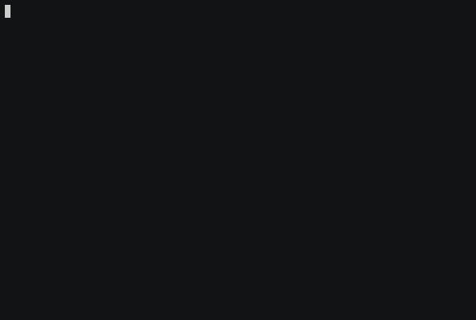

# clj-parrot

This is a clojure port of [parrot-live](https://github.com/hugomd/parrot.live). It runs a webserver that provides a curlable animated [party-parrot](http://cultofthepartyparrot.com/).  

## Usage

Run the server

    $ lein run
    
Curl it

    $ curl localhost:3000/parrot
    
Party!

## Thanks
[hugomd](https://github.com/hugomd) for the inspiration with [parrot.live](https://github.com/hugomd/parrot.live)

## License

Distributed under the MIT License, see LICENSE for the full text.
